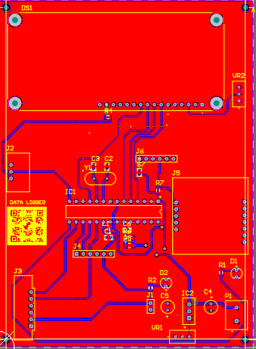
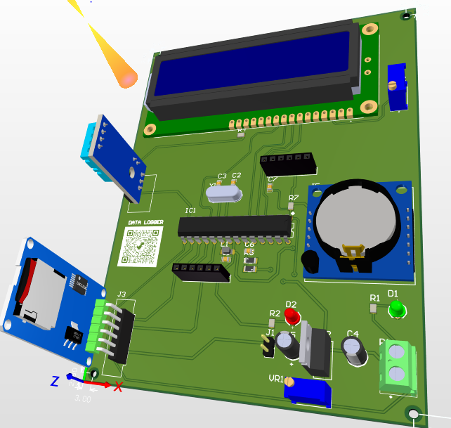

# 📟 Data Logger – Altium Project

This repository contains the complete **Altium Designer project files** for a custom **Data Logger** PCB.  
The design allows acquisition, storage, and transfer of sensor data for embedded or IoT applications.  

---

## 🔹 Features
- Designed in **Altium Designer**
- Support for **multiple sensors** (temperature, humidity, etc.)
- **Microcontroller-based** for data acquisition and control
- **SD card / external memory interface** for data storage
- **USB / UART communication** for data transfer
- Compact, low-power design

---

## 📂 Repository Contents
- `Project Files/` – Altium schematic & PCB source files  
- `Libraries/` – Custom component libraries  
- `Outputs/` – Generated fabrication files (Gerber, BOM, 3D models, etc.)  

## 🖼️ Preview

### Schematic


### PCB (2D View)


### PCB (3D View)


---

## 🚀 Usage
1. Clone this repository:
   ```bash
   git clone https://github.com/brahimjarallah/Data_Logger.git

